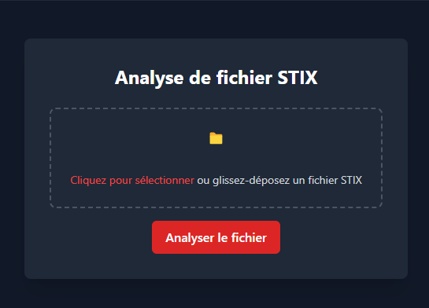
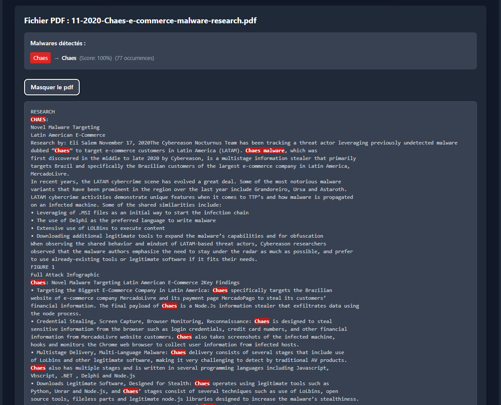

# **Aggregator Stix/PDF**
Cet outil permet de comparer des fichiers STIX JSON à des PDF afin d'identifier et de mettre en évidence des correspondances, comme des malwares ou des termes spécifiques. L'application dispose d'une interface frontend intuitive et d'un backend puissant pour le traitement des données.

## Exemple de la vue principale :


## Exemple de la vue des résultats :


## Démarrer avec Docker Compose


```bash
docker-compose up -d
```

### Remarque importante :
Temps de démarrage initial prolongé : Le conteneur fastapi-app peut prendre du temps à démarrer lors de la première exécution. Cela est dû au traitement initial des fichiers PDF présents dans le dossier data/pdfs.
Pendant ce processus, vous pouvez vérifier les journaux du conteneur pour suivre l'avancement 

```bash	
docker logs fastapi-app
```

## Accéder à l'application :

Une fois les conteneurs démarrés, ouvrez votre navigateur et rendez-vous sur :

 [application frontend](http://localhost:80)

uploader n'importe quel fichier STIX afin d'avoir le résultat.

<!-- # Launch backend

cd backend
python3 -m pip install -r requirements.txt
uvicorn main:app --reload

# Launch frontend

cd frontend
npm install
npm run dev -->